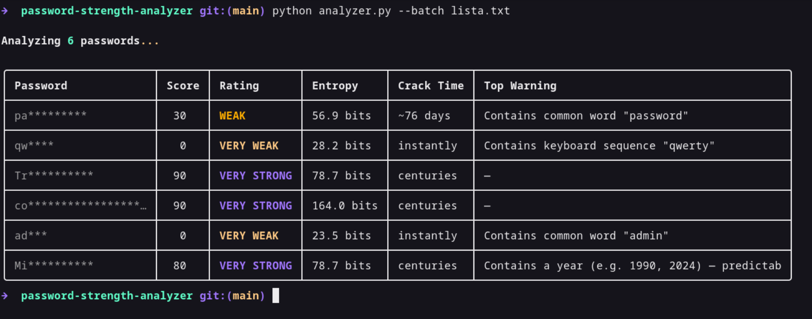

# Password Strength Analyzer & Secure Vault

[](https://www.python.org/)
[](LICENSE)
[](https://owasp.org/)
[]()

**A real-time password strength analyzer with entropy scoring, pattern detection, breach database lookup, and a secure local vault for password storage.**

[Features](#-features) · [Demo](#-demo) · [Installation](#-installation) · [Usage](#-usage) · [How It Works](#-how-it-works) · [Roadmap](#-roadmap)

---

## Demo



> *Real-time analysis as you type — entropy score, breach check and actionable feedback*

---

## Features

### Password Analysis

| Feature | Description |
|---------|-------------|
| **Entropy Score** | Calculates bits of entropy using character set and length |
| **Pattern Detection** | Identifies keyboard walks, dates, repeated chars, common words |
| **Breach Check** | Checks against Have I Been Pwned API (k-anonymity, no plaintext sent) |
| **Dictionary Attack Sim** | Tests against top 10k passwords from RockYou dataset |
| **Rich CLI Output** | Color-coded feedback using `rich` library |
| **Web UI** | Optional Flask interface with live strength meter |
| **Scoring Report** | Detailed breakdown exportable as JSON |

### Secure Vault (new)

| Feature | Description |
|---------|-------------|
| **Master Key Derivation** | PBKDF2-HMAC-SHA256 with 600k iterations and unique salt |
| **AES-256-GCM Encryption** | Authenticated encryption that detects tampering |
| **Local JSON Vault** | All data stays on your machine, encrypted at rest |
| **CRUD Operations** | Add, retrieve, update, and delete stored entries |

---

## Installation

### Prerequisites

- Python 3.10+
- pip

### Clone & install

```bash
git clone https://github.com/roxanatera/password-strength-analyzer.git
cd password-strength-analyzer
python3 -m venv .venv
source .venv/bin/activate
pip install -r requirements.txt
Dependencies
rich>=13.0
requests>=2.28
zxcvbn>=4.4.28
cryptography>=41.0
flask>=2.3          # optional, for web UI
pytest>=7.0         # optional, for tests
Usage
CLI — single password
python analyzer.py --password "MyP@ssw0rd!"
Output:
┌─────────────────────────────────────────┐
│        Password Strength Report         │
├─────────────────────────────────────────┤
│ Score       ████████░░  72/100  STRONG  │
│ Entropy     43.2 bits                   │
│ Crack time  ~3 years (offline, fast)    │
│ HaveIBeenPwned  Not found               │
├─────────────────────────────────────────┤
│  Warnings                               │
│  - Contains dictionary word: "password" │
│  - Predictable leet substitution: @->a  │
├─────────────────────────────────────────┤
│  Suggestions                            │
│  - Add 2+ more random characters        │
│  - Avoid common substitutions           │
└─────────────────────────────────────────┘
CLI — interactive mode
python analyzer.py --interactive
Web UI (Flask)
python web/app.py
# Open http://localhost:5000
Batch mode (for auditing)
python analyzer.py --batch passwords.txt --output report.json
How It Works
Password analysis flow
Input Password
      |
      v
+-------------+    +------------------+    +-----------------+
|  Entropy    |    | Pattern          |    |  Breach         |
|  Calculator |    | Detector         |    |  Lookup (HIBP)  |
|             |    |                  |    |                 |
| - charset   |    | - keyboard walks |    | - SHA-1 prefix  |
| - length    |    | - leet speak     |    | - k-anonymity   |
| - uniqueness|    | - dates/years    |    | - pwned count   |
+------+------+    +-------+----------+    +--------+--------+
       |                   |                        |
       +-------------------+------------------------+
                           |
                           v
                   +---------------+
                   |  Score Engine |
                   |  0 - 100 pts  |
                   +-------+-------+
                           |
                           v
                   +---------------+
                   |  Rich Report  |
                   |  CLI / JSON   |
                   +---------------+
Entropy formula
Entropy (bits) = log2(charset_size ^ length)
Charset
Lowercase only
+ Uppercase
+ Numbers
+ Symbols
A password with >60 bits of entropy is considered strong against offline attacks.
Vault cryptography
Master Password
       |
       v
+---------------------------+
| PBKDF2-HMAC-SHA256        |
| iterations = 600000       |
| salt = os.urandom(16)     |
+-------------+-------------+
              |
              v
       256-bit key
              |
              v
+---------------------------+
| AES-256-GCM               |
| nonce = os.urandom(12)    |
| encrypt(plaintext)        |
| -> nonce + ciphertext     |
|    + auth tag             |
+---------------------------+
              |
              v
      vault.json (at rest)
- PBKDF2 turns the master password into a 256-bit key, applying 600,000 iterations to slow down brute force attacks.
- AES-GCM provides authenticated encryption: it encrypts the data and generates a tag that detects any modification.
- Salt and nonce are stored in plaintext next to the ciphertext. They are not secrets — they guarantee uniqueness.
Project Structure
password-strength-analyzer/
|
+-- analyzer.py          # Main CLI entrypoint
+-- core/
|   +-- entropy.py       # Entropy calculation
|   +-- patterns.py      # Pattern detection engine
|   +-- hibp.py          # Have I Been Pwned API client
|   +-- scorer.py        # Final score aggregation
|   +-- crypto.py        # PBKDF2, AES-GCM encrypt/decrypt
|   +-- vault.py         # (WIP) Vault CRUD operations
|
+-- web/
|   +-- app.py           # Flask app
|   +-- templates/
|       +-- index.html   # Live strength meter UI
|
+-- data/
|   +-- top10k.txt       # Common passwords wordlist
|
+-- tests/
|   +-- test_entropy.py
|   +-- test_patterns.py
|   +-- test_scorer.py
|   +-- test_crypto.py   # (WIP) Crypto round-trip tests
|
+-- assets/
|   +-- demo.png         # Demo screenshot for README
|
+-- requirements.txt
+-- .gitignore
+-- README.md
Tests
pytest tests/ -v
PASSED tests/test_entropy.py::test_lowercase_only
PASSED tests/test_entropy.py::test_mixed_charset
PASSED tests/test_patterns.py::test_keyboard_walk_detected
PASSED tests/test_patterns.py::test_leet_substitution
PASSED tests/test_scorer.py::test_strong_password_score
PASSED tests/test_scorer.py::test_breached_password_penalty

6 passed in 0.42s
Privacy & Ethics
- HIBP check uses k-anonymity: only the first 5 characters of the SHA-1 hash are sent over the network. Your password is never transmitted.
- Vault data never leaves your machine: everything is encrypted locally with AES-256-GCM before being written to disk.
- This tool is intended for educational and defensive purposes only.
- Do not use it to audit passwords you don't own.
Roadmap
- CLI with entropy scoring
- Pattern detection engine
- HIBP breach lookup
- Crypto primitives (PBKDF2, AES-GCM)
- Secure vault with CRUD operations
- Password generator with strength feedback
- Tests for crypto and vault modules
- CLI commands for vault management
- Integration: score passwords on add/update
- Browser extension version
- Support for passphrases (NIST SP 800-63B)
- Docker image
References & Learning
- OWASP Authentication Cheat Sheet (https://cheatsheetseries.owasp.org/cheatsheets/Authentication_Cheat_Sheet.html)
- NIST SP 800-63B -- Digital Identity Guidelines (https://pages.nist.gov/800-63-3/sp800-63b.html)
- Have I Been Pwned API (https://haveibeenpwned.com/API/v3)
- zxcvbn -- Realistic password strength estimation (https://github.com/dropbox/zxcvbn)
- cryptography.io -- Python crypto library (https://cryptography.io/)
Author
Julia Roxana Natera
LinkedIn (https://www.linkedin.com/in/julia-roxana-natera-917b62172/)
Built as part of my cybersecurity learning journey. Feedback and PRs welcome!

---

- **Features**: tabla nueva con las capacidades del vault (PBKDF2, AES-GCM, etc.)
- **Vault cryptography**: diagrama explicando el flujo de cifrado
- **Project structure**: añadido `crypto.py` y marcado `vault.py` y `test_crypto.py` como WIP
- **Roadmap**: marcado con `[x]` lo que ya está hecho y `[ ]` lo pendiente
- **References**: añadido enlace a cryptography.io
